# Bmob即时聊天开发组件

## 界面效果

注册页面

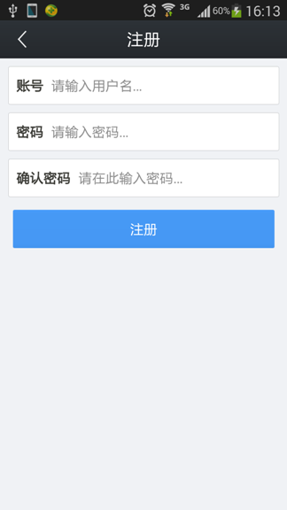

登录页面

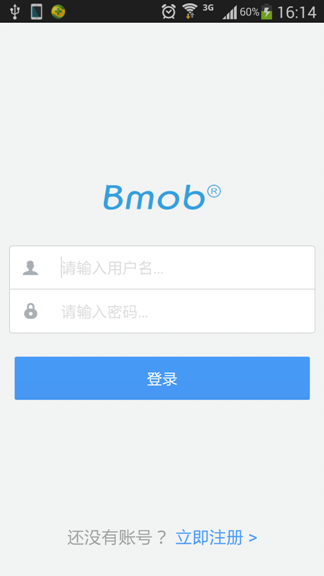

会话页面

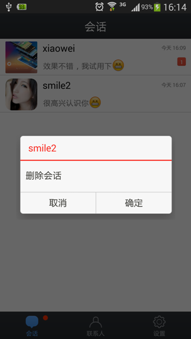

聊天页面

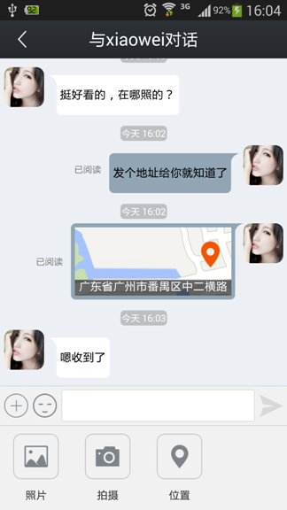

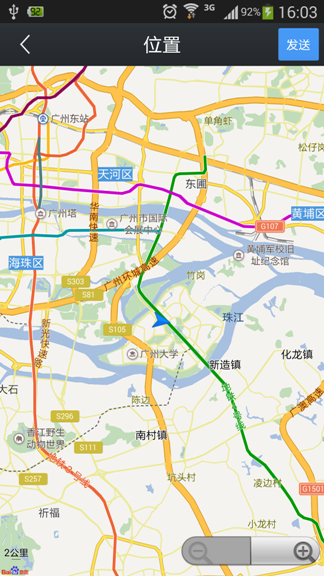

语音聊天页面

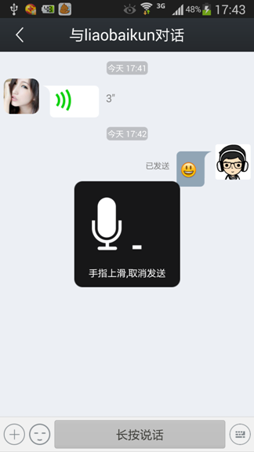

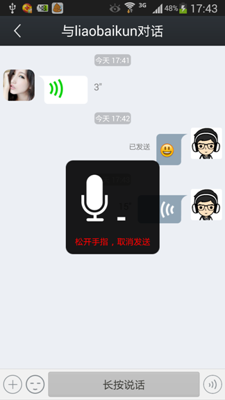

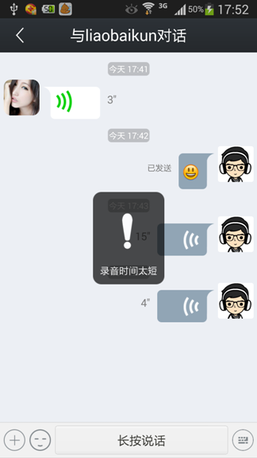

通讯录页面

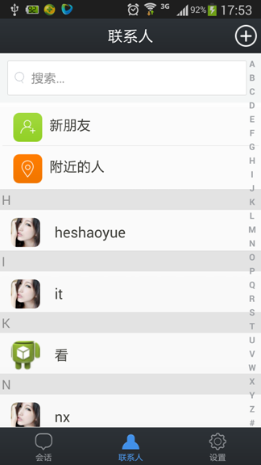

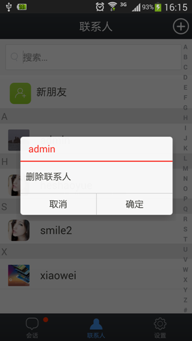

黑名单页面

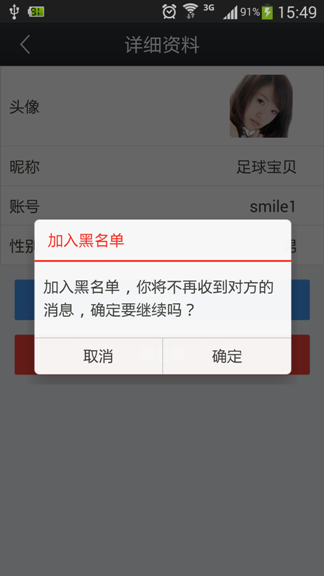

查找好友页面

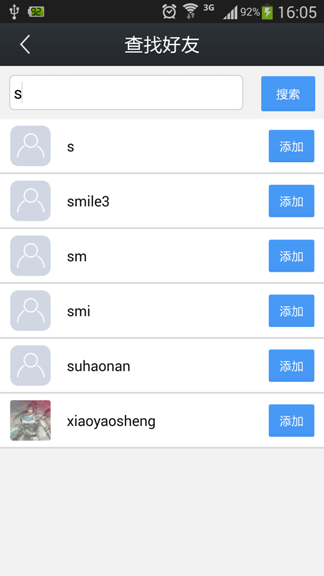

新朋友页面

附近的人页面

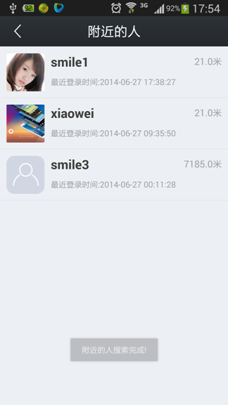

个人资料页面

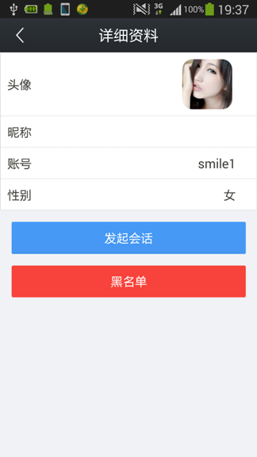

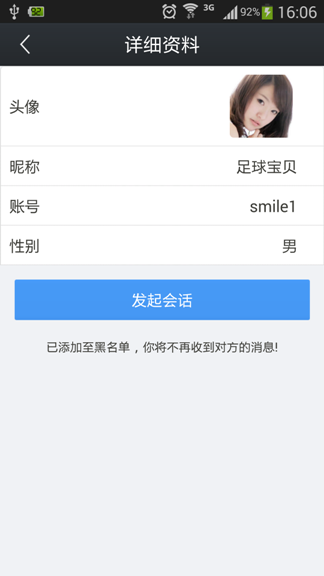

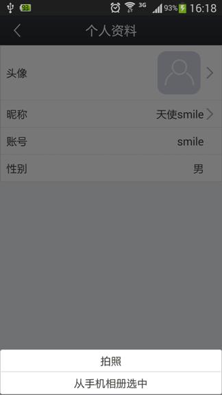

设置页面

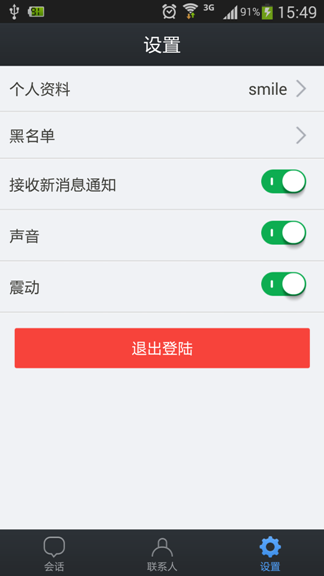

## 实现功能

1. 支持好友管理功能，包括添加好友、删除好友、获取好友列表，也可以与你已有的用户系统完全解耦；
2. 支持的消息类型：纯文本、聊天表情、图片、位置、语音；
3. 支持会话的本地化存储；
4. 自定义消息处理机制；
5. 同一账号多处登陆强制下线；
6. 支持消息回执发送：已发送、已阅读两种状态；
7. 支持黑名单管理功能；
8. 支持消息重发机制，由网络或者其他原因导致的消息发送失败皆可点击重发；
9. 支持地理位置交友；
10. 支持跨平台聊天，与ios端完成互通。

## 后期更新计划

1. 增加在线、离线状态的显示；
2. 增加群聊模式，方便群管理；

## 看本应用源码能学到啥

1. 认识和深入了解Bmob：

Bmob专注于帮助开发者解决后端云存储，无须搭建后台即可开发出一款高性能的app；

2. 最新百度地图sdk的用法：

获取用户的当前地理位置信息，当无法获取到地理位置的时候，采用反编码方式根据经纬度查询当前地理位置信息。（因为百度地图官网上的目前最新的sdk和我之前用过的很不一样，新版百度地图sdk进行了重构和优化，很多之前熟知的api都改掉了。不清楚的可以去瞧瞧。）

3. 最简洁Viewholder的用法：

论坛内有人分享过的关于Viewholder最简洁用法：http://www.eoeandroid.com/thread-321547-1-1.html
这可是和实例相结合的哦，相信大家更加容易理解和运用。

4. 最适合做聊天界面的MessageChatadapter的写法：根据不同的消息类型展示不用类型Item界面，利用getItemViewType和getViewTypeCount两个方法。同时和最简洁的Viewholder写法融合起来。

5. 超简洁Adapter写法，支持在adapter内部添加点击事件，方便为ListView单个item中的控件添加点击事件。

此方法是本人在藤之内的极速开发框架dhroid中学习到的，不明白的可移步框架总档：http://www.eoeandroid.com/thread-326973-1-1.html

6. 头像裁剪

相信很多应用都会有用户的详细资料页面，关于用户头像部分无疑也是比较头疼的，目前大部分应用的头像部分会有两种方式：一种是利用系统的裁剪功能去获取用户头像，一种就是获取到图片或者照片的地址后自定义头像裁剪界面。而我这里提供了一种利用系统的裁剪功能来获取头像的写法，当然我写的这个并不是最好的。如果大家有比较好的写法可以和我交流下。

7. 实现类似微信通讯录页面的效果，并支持对联系人的查找和过滤。

8. 自定义Dialog写法，支持各种不同类型的dialog的显示。

9. 利用Fragment创建类似Tabhost样式的布局。

## 常见问题解答

很多童靴反应收不到消息在这里我说明几点:

1. 请使用最新版本的sdk，目前最新版是V1.1.1，因为新版本修复了一些开发者提出的问题。同时，从V1.0.6版本开始，后面的版本将不再公开ApplicationId，请到官网申请。
2. 目前由于sdk正在不断完善的过程中，所以高版本与低版本是不兼容的，也就是说，用高版本sdk的应用向低版本sdk的应用发送消息是收不到的，甚至会导致程序奔溃。因此建议均使用最新版本sdk，等sdk稳定后，版本之间会做兼容的。
3. 在安装新版本sdk的应用之前，请卸载掉你手机里面的低版本sdk的应用，且卸载前点击清除缓存和清除数据两个按钮，之后再卸载，如果单纯的点击卸载的话，该应用内部会有些缓存保留，等安装新版本后会继续使用之前版本的一些数据，所以也会导致收不到消息。
4. 另外有人反映发送位置的时候，定位不了，谢谢这位童靴的问题哦，现说明下：你是下载demo之后直接运行的话，需要去重新去百度地图官网申请key,因为demo里面的可以是和我的eclipse绑定在一起的，相信做过百度地图开发的知道这是为什么。
5. 工程所用的编码格式是GBK，所以大家导入到eclipse的时候需要自行修改下编码方式哦！
6. 请大家用两台真机测试，模拟器和平板电脑未经过测试，故无法保证其能无法正常接收到消息。
7. 是否安装有Bmob的AndroidSdk自带的BmobExample的Demo,因为此IM是基于Bmob推送服务的，而sdk的demo里面也有演示推送服务的例子，但demo里面的BmobPush的sdk版本与我的IM里面的推送版本是不一样的，所以，如果安装的话，会影响到Im的消息接收，请卸载后重试！
     

## Bmob官方信息

官方网址：[http://www.bmob.cn](http://www.bmob.cn)

问答社区：[http://wenda.bmob.cn](http://wenda.bmob.cn)

技术邮箱：support@bmob.cn
